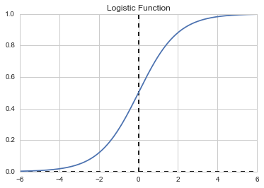
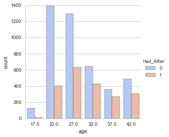
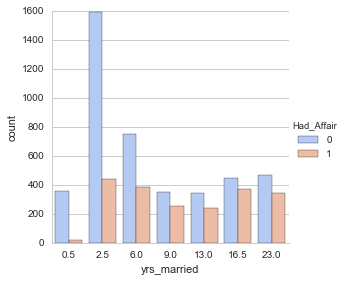
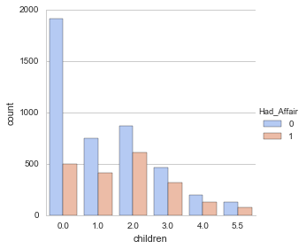
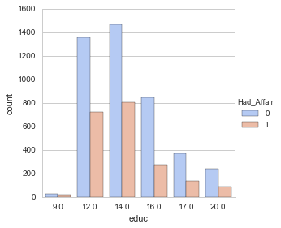

## Supervised Learning: Logistic Regression

We will use Logistic Regression to perform classification of a data set (specifially binary classification)


```python
# Data Imports
import numpy as np
import pandas as pd
from pandas import Series, DataFrame

# Math
import math

#Plot imports
import matplotlib.pyplot as plt
import seaborn as sns
sns.set_style('whitegrid')
%matplotlib inline

# Machine learning imports
from sklearn.linear_model import LogisticRegression
from sklearn.cross_validation import train_test_split

# For evaluating our ML results
from sklearn import metrics

# Dataset import
import statsmodels.api as sm
```


```python
#Plot A graph of the Logistic function
def Logistic(t):
    return 1/(1+math.exp(-1*t))

#set a range of values for t
t = np.linspace(-6,6,500)

#Set up y values using list comprehension, i.e. a 1-line for loop for 
#creating a list
y = np.array([Logistic(i) for i in t])

#Plot
plt.plot(t,y)
plt.title('Logistic Function')

#Plot a horizontal axis at y=0.5
plt.hlines(y=0, xmin=-6, xmax=6, linestyles='dashed') 
plt.vlines(x=0, ymin=0, ymax=1, linestyles='dashed')
```


    <matplotlib.collections.LineCollection at 0x5e2d3756a0>





### Dataset Analysis

The dataset is packaged within Statsmodels. It is a data set from a 1974 survey of women by Redbook magazine. Married women were asked if they have had extramarital affairs. A descriptionof the Dataset can be found in http://statsmodels.sourceforge.net/stable/datasets/generated/fair.html

The published work on the data set can be found in: Fair, Ray. 1978. “A Theory of Extramarital Affairs,” Journal of Political Economy, February, 45-61. http://fairmodel.econ.yale.edu/rayfair/pdf/1978a200.pdf

In this case, we want to classify the women as either having had an extramarital affair or not, based on certain variables

Description from the Statsmodels website:

Number of observations: 6366
Number of variables: 9
Variable name definitions:

    rate_marriage   : How rate marriage, 1 = very poor, 2 = poor, 3 = fair,
                    4 = good, 5 = very good
    age             : Age
    yrs_married     : No. years married. Interval approximations. See
                    original paper for detailed explanation.
    children        : No. children
    religious       : How relgious, 1 = not, 2 = mildly, 3 = fairly,
                    4 = strongly
    educ            : Level of education, 9 = grade school, 12 = high
                    school, 14 = some college, 16 = college graduate,
                    17 = some graduate school, 20 = advanced degree
    occupation      : 1 = student, 2 = farming, agriculture; semi-skilled,
                    or unskilled worker; 3 = white-colloar; 4 = teacher
                    counselor social worker, nurse; artist, writers;
                    technician, skilled worker, 5 = managerial,
                    administrative, business, 6 = professional with
                    advanced degree
    occupation_husb : Husband's occupation. Same as occupation.
    affairs         : measure of time spent in extramarital affairs

See the original paper for more details.

### Data Visualization


```python
# Standard method of loading Statsmodels datasets into a pandas DataFrame. 
# Note the name fair stands for 'affair' dataset.
df = sm.datasets.fair.load_pandas().data
```


```python
df.head()
```


<div>
<table border="1" class="dataframe">
  <thead>
    <tr style="text-align: right;">
      <th></th>
      <th>rate_marriage</th>
      <th>age</th>
      <th>yrs_married</th>
      <th>children</th>
      <th>religious</th>
      <th>educ</th>
      <th>occupation</th>
      <th>occupation_husb</th>
      <th>affairs</th>
    </tr>
  </thead>
  <tbody>
    <tr>
      <th>0</th>
      <td>3.0</td>
      <td>32.0</td>
      <td>9.0</td>
      <td>3.0</td>
      <td>3.0</td>
      <td>17.0</td>
      <td>2.0</td>
      <td>5.0</td>
      <td>0.111111</td>
    </tr>
    <tr>
      <th>1</th>
      <td>3.0</td>
      <td>27.0</td>
      <td>13.0</td>
      <td>3.0</td>
      <td>1.0</td>
      <td>14.0</td>
      <td>3.0</td>
      <td>4.0</td>
      <td>3.230769</td>
    </tr>
    <tr>
      <th>2</th>
      <td>4.0</td>
      <td>22.0</td>
      <td>2.5</td>
      <td>0.0</td>
      <td>1.0</td>
      <td>16.0</td>
      <td>3.0</td>
      <td>5.0</td>
      <td>1.400000</td>
    </tr>
    <tr>
      <th>3</th>
      <td>4.0</td>
      <td>37.0</td>
      <td>16.5</td>
      <td>4.0</td>
      <td>3.0</td>
      <td>16.0</td>
      <td>5.0</td>
      <td>5.0</td>
      <td>0.727273</td>
    </tr>
    <tr>
      <th>4</th>
      <td>5.0</td>
      <td>27.0</td>
      <td>9.0</td>
      <td>1.0</td>
      <td>1.0</td>
      <td>14.0</td>
      <td>3.0</td>
      <td>4.0</td>
      <td>4.666666</td>
    </tr>
  </tbody>
</table>
</div>


Create a new column called Had_Affair. The value in this column will be set to 0 if the affairs column is 0, i.e., there was no time spent in an affair, else
The value will be set to 1, indicating the woman had an affair


```python
def affair_check(x):
    if x !=0:
        return 1
    else:
        return 0
```


```python
df['Had_Affair'] = df['affairs'].apply(affair_check)
```


```python
df.head()
```


<div>
<table border="1" class="dataframe">
  <thead>
    <tr style="text-align: right;">
      <th></th>
      <th>rate_marriage</th>
      <th>age</th>
      <th>yrs_married</th>
      <th>children</th>
      <th>religious</th>
      <th>educ</th>
      <th>occupation</th>
      <th>occupation_husb</th>
      <th>affairs</th>
      <th>Had_Affair</th>
    </tr>
  </thead>
  <tbody>
    <tr>
      <th>0</th>
      <td>3.0</td>
      <td>32.0</td>
      <td>9.0</td>
      <td>3.0</td>
      <td>3.0</td>
      <td>17.0</td>
      <td>2.0</td>
      <td>5.0</td>
      <td>0.111111</td>
      <td>1</td>
    </tr>
    <tr>
      <th>1</th>
      <td>3.0</td>
      <td>27.0</td>
      <td>13.0</td>
      <td>3.0</td>
      <td>1.0</td>
      <td>14.0</td>
      <td>3.0</td>
      <td>4.0</td>
      <td>3.230769</td>
      <td>1</td>
    </tr>
    <tr>
      <th>2</th>
      <td>4.0</td>
      <td>22.0</td>
      <td>2.5</td>
      <td>0.0</td>
      <td>1.0</td>
      <td>16.0</td>
      <td>3.0</td>
      <td>5.0</td>
      <td>1.400000</td>
      <td>1</td>
    </tr>
    <tr>
      <th>3</th>
      <td>4.0</td>
      <td>37.0</td>
      <td>16.5</td>
      <td>4.0</td>
      <td>3.0</td>
      <td>16.0</td>
      <td>5.0</td>
      <td>5.0</td>
      <td>0.727273</td>
      <td>1</td>
    </tr>
    <tr>
      <th>4</th>
      <td>5.0</td>
      <td>27.0</td>
      <td>9.0</td>
      <td>1.0</td>
      <td>1.0</td>
      <td>14.0</td>
      <td>3.0</td>
      <td>4.0</td>
      <td>4.666666</td>
      <td>1</td>
    </tr>
  </tbody>
</table>
</div>


```python
df.tail()
```


<div>
<table border="1" class="dataframe">
  <thead>
    <tr style="text-align: right;">
      <th></th>
      <th>rate_marriage</th>
      <th>age</th>
      <th>yrs_married</th>
      <th>children</th>
      <th>religious</th>
      <th>educ</th>
      <th>occupation</th>
      <th>occupation_husb</th>
      <th>affairs</th>
      <th>Had_Affair</th>
    </tr>
  </thead>
  <tbody>
    <tr>
      <th>6361</th>
      <td>5.0</td>
      <td>32.0</td>
      <td>13.0</td>
      <td>2.0</td>
      <td>3.0</td>
      <td>17.0</td>
      <td>4.0</td>
      <td>3.0</td>
      <td>0.0</td>
      <td>0</td>
    </tr>
    <tr>
      <th>6362</th>
      <td>4.0</td>
      <td>32.0</td>
      <td>13.0</td>
      <td>1.0</td>
      <td>1.0</td>
      <td>16.0</td>
      <td>5.0</td>
      <td>5.0</td>
      <td>0.0</td>
      <td>0</td>
    </tr>
    <tr>
      <th>6363</th>
      <td>5.0</td>
      <td>22.0</td>
      <td>2.5</td>
      <td>0.0</td>
      <td>2.0</td>
      <td>14.0</td>
      <td>3.0</td>
      <td>1.0</td>
      <td>0.0</td>
      <td>0</td>
    </tr>
    <tr>
      <th>6364</th>
      <td>5.0</td>
      <td>32.0</td>
      <td>6.0</td>
      <td>1.0</td>
      <td>3.0</td>
      <td>14.0</td>
      <td>3.0</td>
      <td>4.0</td>
      <td>0.0</td>
      <td>0</td>
    </tr>
    <tr>
      <th>6365</th>
      <td>4.0</td>
      <td>22.0</td>
      <td>2.5</td>
      <td>0.0</td>
      <td>2.0</td>
      <td>16.0</td>
      <td>2.0</td>
      <td>4.0</td>
      <td>0.0</td>
      <td>0</td>
    </tr>
  </tbody>
</table>
</div>


```python
df.groupby('Had_Affair').mean()
```


<div>
<table border="1" class="dataframe">
  <thead>
    <tr style="text-align: right;">
      <th></th>
      <th>rate_marriage</th>
      <th>age</th>
      <th>yrs_married</th>
      <th>children</th>
      <th>religious</th>
      <th>educ</th>
      <th>occupation</th>
      <th>occupation_husb</th>
      <th>affairs</th>
    </tr>
    <tr>
      <th>Had_Affair</th>
      <th></th>
      <th></th>
      <th></th>
      <th></th>
      <th></th>
      <th></th>
      <th></th>
      <th></th>
      <th></th>
    </tr>
  </thead>
  <tbody>
    <tr>
      <th>0</th>
      <td>4.329701</td>
      <td>28.390679</td>
      <td>7.989335</td>
      <td>1.238813</td>
      <td>2.504521</td>
      <td>14.322977</td>
      <td>3.405286</td>
      <td>3.833758</td>
      <td>0.000000</td>
    </tr>
    <tr>
      <th>1</th>
      <td>3.647345</td>
      <td>30.537019</td>
      <td>11.152460</td>
      <td>1.728933</td>
      <td>2.261568</td>
      <td>13.972236</td>
      <td>3.463712</td>
      <td>3.884559</td>
      <td>2.187243</td>
    </tr>
  </tbody>
</table>
</div>


Looking at this brief glance of the data, it seems that the women who had 
affairs were slightly older, married longer, slightly less religious,
and less educated. However, the mean values of both classes are very close
for all variables. 

We can visualize the dataset using Seaborn


```python
#Factorplot with Seaborn
sns.factorplot('age', data=df, hue='Had_Affair', palette='coolwarm', kind='count')
```


    <seaborn.axisgrid.FacetGrid at 0x5e2d092a90>





```python
sns.factorplot('yrs_married', data=df, hue='Had_Affair', palette='coolwarm', kind='count')
```


    <seaborn.axisgrid.FacetGrid at 0x5e2d514080>





```python
sns.factorplot('children', data=df, hue='Had_Affair', palette='coolwarm', kind='count')
```


    <seaborn.axisgrid.FacetGrid at 0x5e2d71e630>





```python
sns.factorplot('educ', data=df, hue='Had_Affair', palette='coolwarm', kind='count')
```


    <seaborn.axisgrid.FacetGrid at 0x5e2defe438>





### Preparing the Data for Logistic Regression

occupation and occupation_husb are categorical variables, so we will create
new dummy variables and columns for threse variables


```python
#create new DataFrames for the categorical variables
occ_dummies = pd.get_dummies(df['occupation'])
hus_occ_dummies = pd.get_dummies(df['occupation_husb'])
```


```python
occ_dummies.head()
```


<div>
<table border="1" class="dataframe">
  <thead>
    <tr style="text-align: right;">
      <th></th>
      <th>1.0</th>
      <th>2.0</th>
      <th>3.0</th>
      <th>4.0</th>
      <th>5.0</th>
      <th>6.0</th>
    </tr>
  </thead>
  <tbody>
    <tr>
      <th>0</th>
      <td>0.0</td>
      <td>1.0</td>
      <td>0.0</td>
      <td>0.0</td>
      <td>0.0</td>
      <td>0.0</td>
    </tr>
    <tr>
      <th>1</th>
      <td>0.0</td>
      <td>0.0</td>
      <td>1.0</td>
      <td>0.0</td>
      <td>0.0</td>
      <td>0.0</td>
    </tr>
    <tr>
      <th>2</th>
      <td>0.0</td>
      <td>0.0</td>
      <td>1.0</td>
      <td>0.0</td>
      <td>0.0</td>
      <td>0.0</td>
    </tr>
    <tr>
      <th>3</th>
      <td>0.0</td>
      <td>0.0</td>
      <td>0.0</td>
      <td>0.0</td>
      <td>1.0</td>
      <td>0.0</td>
    </tr>
    <tr>
      <th>4</th>
      <td>0.0</td>
      <td>0.0</td>
      <td>1.0</td>
      <td>0.0</td>
      <td>0.0</td>
      <td>0.0</td>
    </tr>
  </tbody>
</table>
</div>


```python
occ_dummies.columns = ['occ1','occ2','occ3','occ4','occ5','occ6']
```


```python
hus_occ_dummies.columns = ['hocc1','hocc2','hocc3','hocc4','hocc5','hocc6']
```


```python
X = df.drop(['occupation','occupation_husb','Had_Affair'],axis=1)
```


```python
dummies = pd.concat([occ_dummies, hus_occ_dummies], axis=1)
```


```python
X = pd.concat([X,dummies],axis=1)
```


```python
X.head()
```


<div>
<table border="1" class="dataframe">
  <thead>
    <tr style="text-align: right;">
      <th></th>
      <th>rate_marriage</th>
      <th>age</th>
      <th>yrs_married</th>
      <th>children</th>
      <th>religious</th>
      <th>educ</th>
      <th>affairs</th>
      <th>occ1</th>
      <th>occ2</th>
      <th>occ3</th>
      <th>occ4</th>
      <th>occ5</th>
      <th>occ6</th>
      <th>hocc1</th>
      <th>hocc2</th>
      <th>hocc3</th>
      <th>hocc4</th>
      <th>hocc5</th>
      <th>hocc6</th>
    </tr>
  </thead>
  <tbody>
    <tr>
      <th>0</th>
      <td>3.0</td>
      <td>32.0</td>
      <td>9.0</td>
      <td>3.0</td>
      <td>3.0</td>
      <td>17.0</td>
      <td>0.111111</td>
      <td>0.0</td>
      <td>1.0</td>
      <td>0.0</td>
      <td>0.0</td>
      <td>0.0</td>
      <td>0.0</td>
      <td>0.0</td>
      <td>0.0</td>
      <td>0.0</td>
      <td>0.0</td>
      <td>1.0</td>
      <td>0.0</td>
    </tr>
    <tr>
      <th>1</th>
      <td>3.0</td>
      <td>27.0</td>
      <td>13.0</td>
      <td>3.0</td>
      <td>1.0</td>
      <td>14.0</td>
      <td>3.230769</td>
      <td>0.0</td>
      <td>0.0</td>
      <td>1.0</td>
      <td>0.0</td>
      <td>0.0</td>
      <td>0.0</td>
      <td>0.0</td>
      <td>0.0</td>
      <td>0.0</td>
      <td>1.0</td>
      <td>0.0</td>
      <td>0.0</td>
    </tr>
    <tr>
      <th>2</th>
      <td>4.0</td>
      <td>22.0</td>
      <td>2.5</td>
      <td>0.0</td>
      <td>1.0</td>
      <td>16.0</td>
      <td>1.400000</td>
      <td>0.0</td>
      <td>0.0</td>
      <td>1.0</td>
      <td>0.0</td>
      <td>0.0</td>
      <td>0.0</td>
      <td>0.0</td>
      <td>0.0</td>
      <td>0.0</td>
      <td>0.0</td>
      <td>1.0</td>
      <td>0.0</td>
    </tr>
    <tr>
      <th>3</th>
      <td>4.0</td>
      <td>37.0</td>
      <td>16.5</td>
      <td>4.0</td>
      <td>3.0</td>
      <td>16.0</td>
      <td>0.727273</td>
      <td>0.0</td>
      <td>0.0</td>
      <td>0.0</td>
      <td>0.0</td>
      <td>1.0</td>
      <td>0.0</td>
      <td>0.0</td>
      <td>0.0</td>
      <td>0.0</td>
      <td>0.0</td>
      <td>1.0</td>
      <td>0.0</td>
    </tr>
    <tr>
      <th>4</th>
      <td>5.0</td>
      <td>27.0</td>
      <td>9.0</td>
      <td>1.0</td>
      <td>1.0</td>
      <td>14.0</td>
      <td>4.666666</td>
      <td>0.0</td>
      <td>0.0</td>
      <td>1.0</td>
      <td>0.0</td>
      <td>0.0</td>
      <td>0.0</td>
      <td>0.0</td>
      <td>0.0</td>
      <td>0.0</td>
      <td>1.0</td>
      <td>0.0</td>
      <td>0.0</td>
    </tr>
  </tbody>
</table>
</div>


```python
Y = df.Had_Affair
Y.head()
```


    0    1
    1    1
    2    1
    3    1
    4    1
    Name: Had_Affair, dtype: int64


### Multicollinearity Consideration
Multicollinearity exists because of the dummy variables we created. The dummy variables are highly correlated, and so our model gets distorted because one of the dummy variables can be predicted from the others. We resolve this by dropping one of the dummy variables from each set - we do this at the cost of losing a dataset point

We will also drop the affairs column because it has been mapped to the Y target, i.e. Had_Affair. see line "In [22]"


```python
X.drop('occ1',axis=1, inplace=True)
```


```python
X.drop('hocc1',axis=1, inplace=True)
```


```python
X.drop('affairs', axis=1, inplace=True)
```


```python
X.head()
```


<div>
<table border="1" class="dataframe">
  <thead>
    <tr style="text-align: right;">
      <th></th>
      <th>rate_marriage</th>
      <th>age</th>
      <th>yrs_married</th>
      <th>children</th>
      <th>religious</th>
      <th>educ</th>
      <th>occ2</th>
      <th>occ3</th>
      <th>occ4</th>
      <th>occ5</th>
      <th>occ6</th>
      <th>hocc2</th>
      <th>hocc3</th>
      <th>hocc4</th>
      <th>hocc5</th>
      <th>hocc6</th>
    </tr>
  </thead>
  <tbody>
    <tr>
      <th>0</th>
      <td>3.0</td>
      <td>32.0</td>
      <td>9.0</td>
      <td>3.0</td>
      <td>3.0</td>
      <td>17.0</td>
      <td>1.0</td>
      <td>0.0</td>
      <td>0.0</td>
      <td>0.0</td>
      <td>0.0</td>
      <td>0.0</td>
      <td>0.0</td>
      <td>0.0</td>
      <td>1.0</td>
      <td>0.0</td>
    </tr>
    <tr>
      <th>1</th>
      <td>3.0</td>
      <td>27.0</td>
      <td>13.0</td>
      <td>3.0</td>
      <td>1.0</td>
      <td>14.0</td>
      <td>0.0</td>
      <td>1.0</td>
      <td>0.0</td>
      <td>0.0</td>
      <td>0.0</td>
      <td>0.0</td>
      <td>0.0</td>
      <td>1.0</td>
      <td>0.0</td>
      <td>0.0</td>
    </tr>
    <tr>
      <th>2</th>
      <td>4.0</td>
      <td>22.0</td>
      <td>2.5</td>
      <td>0.0</td>
      <td>1.0</td>
      <td>16.0</td>
      <td>0.0</td>
      <td>1.0</td>
      <td>0.0</td>
      <td>0.0</td>
      <td>0.0</td>
      <td>0.0</td>
      <td>0.0</td>
      <td>0.0</td>
      <td>1.0</td>
      <td>0.0</td>
    </tr>
    <tr>
      <th>3</th>
      <td>4.0</td>
      <td>37.0</td>
      <td>16.5</td>
      <td>4.0</td>
      <td>3.0</td>
      <td>16.0</td>
      <td>0.0</td>
      <td>0.0</td>
      <td>0.0</td>
      <td>1.0</td>
      <td>0.0</td>
      <td>0.0</td>
      <td>0.0</td>
      <td>0.0</td>
      <td>1.0</td>
      <td>0.0</td>
    </tr>
    <tr>
      <th>4</th>
      <td>5.0</td>
      <td>27.0</td>
      <td>9.0</td>
      <td>1.0</td>
      <td>1.0</td>
      <td>14.0</td>
      <td>0.0</td>
      <td>1.0</td>
      <td>0.0</td>
      <td>0.0</td>
      <td>0.0</td>
      <td>0.0</td>
      <td>0.0</td>
      <td>1.0</td>
      <td>0.0</td>
      <td>0.0</td>
    </tr>
  </tbody>
</table>
</div>


```python
Y.head()
```


    0    1
    1    1
    2    1
    3    1
    4    1
    Name: Had_Affair, dtype: int64


```python
#To use Y with SciKit Learn, we need to set it as a 1-D array. 
#We can use numpy's ravel method to "flatten" the array
Y = np.ravel(Y)
Y
```


    array([1, 1, 1, ..., 0, 0, 0], dtype=int64)


```python
log_model = LogisticRegression()

log_model.fit(X,Y)

log_model.score(X,Y) #Accuracy rating
```


    0.72588752748978946


We have a 72.57% accuracy rating.  Let's go ahead and compare this to the original Y data. We can do this by simply taking the mean of the Y data, since it is in the format 1 or 0, we can use the mean to calulate the percentage of women who reported having affairs. This is known as checking the null error rate.


```python
#Check the percentage of women that had affairs
Y.mean()
```


    0.32249450204209867


We have about 32% of the women having an affair.
This means that if our model just simply guessed "no affair" we would have had 1-0.32=0.68 accuracy (or 68%) accuracy. So while our accuracy rating of 72.57% is better than the null error rate, we aren't doing that much better.

Let's go ahead and check the coefficients of our model to check what seemed to be the stronger predictors.


```python
coeff_df = DataFrame(list(zip(X.columns,np.transpose(log_model.coef_))))
```


```python
coeff_df
```


<div>
<table border="1" class="dataframe">
  <thead>
    <tr style="text-align: right;">
      <th></th>
      <th>0</th>
      <th>1</th>
    </tr>
  </thead>
  <tbody>
    <tr>
      <th>0</th>
      <td>rate_marriage</td>
      <td>[-0.697885418003]</td>
    </tr>
    <tr>
      <th>1</th>
      <td>age</td>
      <td>[-0.0563470329082]</td>
    </tr>
    <tr>
      <th>2</th>
      <td>yrs_married</td>
      <td>[0.10390556524]</td>
    </tr>
    <tr>
      <th>3</th>
      <td>children</td>
      <td>[0.0181727821051]</td>
    </tr>
    <tr>
      <th>4</th>
      <td>religious</td>
      <td>[-0.36849604874]</td>
    </tr>
    <tr>
      <th>5</th>
      <td>educ</td>
      <td>[0.00878983466596]</td>
    </tr>
    <tr>
      <th>6</th>
      <td>occ2</td>
      <td>[0.297978583959]</td>
    </tr>
    <tr>
      <th>7</th>
      <td>occ3</td>
      <td>[0.607916072396]</td>
    </tr>
    <tr>
      <th>8</th>
      <td>occ4</td>
      <td>[0.346037767295]</td>
    </tr>
    <tr>
      <th>9</th>
      <td>occ5</td>
      <td>[0.942365139632]</td>
    </tr>
    <tr>
      <th>10</th>
      <td>occ6</td>
      <td>[0.905324430093]</td>
    </tr>
    <tr>
      <th>11</th>
      <td>hocc2</td>
      <td>[0.218433212806]</td>
    </tr>
    <tr>
      <th>12</th>
      <td>hocc3</td>
      <td>[0.32431186171]</td>
    </tr>
    <tr>
      <th>13</th>
      <td>hocc4</td>
      <td>[0.188144831816]</td>
    </tr>
    <tr>
      <th>14</th>
      <td>hocc5</td>
      <td>[0.211584023284]</td>
    </tr>
    <tr>
      <th>15</th>
      <td>hocc6</td>
      <td>[0.214427067949]</td>
    </tr>
  </tbody>
</table>
</div>


Looking at the coefficients we can see that a positive coeffecient corresponds to increasing the likelihood of having an affair while a negative coefficient means it corresponds to a decreased likelihood of having an affair as the actual data value point increases.

As you might expect, an increased marriage rating corresponded to a decrease in the likelihood of having an affair. Increased religiousness also seems to correspond to a decrease in the likelihood of having an affair.

Since all the dummy variables (the wife and husband occupations) are positive that means the lowest likelihood of having an affair corresponds to the baseline occupation we dropped (1-Student).

### Testing and Training Data Sets


```python
#Split the data
X_train, X_test, Y_train, Y_test = train_test_split(X,Y)
```


```python
#Make a new Log model
log_model2= LogisticRegression()

#Fit the log model
log_model2.fit(X_train,Y_train)
```


    LogisticRegression(C=1.0, class_weight=None, dual=False, fit_intercept=True,
              intercept_scaling=1, max_iter=100, multi_class='ovr', n_jobs=1,
              penalty='l2', random_state=None, solver='liblinear', tol=0.0001,
              verbose=0, warm_start=False)


```python
#Predict the classes of the testing data set
class_predict = log_model2.predict(X_test)

#Compare the predicted classes to the actual test classes
#Use Scikit Learn's metrics library
print(metrics.accuracy_score(Y_test,class_predict)) #perfect prediction gives 1
```

    0.724874371859
    

### Conclusion
Now we have a 73.18% accuracy score, which is basically the same as our previous accuracy score, 72.57%.

To improve our Logistic Regression model, we could try some regularization techniques or try using a non-linear model


```python

```
